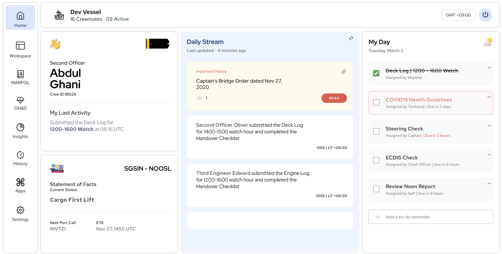

# 🚀 Voyage Dashboard

An interactive **Voyage Dashboard** built using **React.js** to provide insightful analytics and data visualization for travelers and administrators.

## 📸 Screenshot 🖼️


## ✨ Features
- 📊 Dynamic charts and graphs
- 🗺️ Interactive map for tracking voyages
- 📝 Real-time data updates
- 📱 Responsive design for mobile and desktop
- 🔒 User authentication & role-based access

## 🛠️ Technologies Used
- ⚛️ **React.js** – Frontend framework
- 🎨 **CSS** – Styling and layout


## 📂 Project Structure
```
📁 voyage-dashboard/
│-- 📄 README.md   (Project documentation)
│-- 📄 package.json (Dependencies & scripts)
│-- 📁 src/
│   │-- 📄 App.js   (Main component)
│   │-- 📄 index.js (Entry point)
│   │-- 📁 components/ (UI components)
│   │-- 📁 pages/ (Dashboard pages)
│   │-- 📁 assets/ (Images & icons)
│   │-- 📁 styles/ (Global styles)
```

## 📥 Installation & Usage
1. Clone the repository:
   ```bash
   git clone https://github.com/shelavalepallavi/voyage-dashboard.git
   ```
2. Navigate to the project folder:
   ```bash
   cd voyage-dashboard
   ```
3. Install dependencies:
   ```bash
   npm install vite
   ```
4. Start the development server:
   ```bash
   npm run dev
   ```
5. Open your browser and visit `http://localhost:5173`

## 🎯 How to Use
1. 🔑 Log in to access the dashboard.
2. 📊 View interactive charts and reports.
3. 🗺️ Navigate the voyage map for tracking data.
4. 📝 Manage trip details and statistics.

## 💡 Future Enhancements
- 🏷️ Custom filters for data analysis
- 🔔 Notifications for real-time updates
- 📅 Calendar integration for trip planning
- 📌 Bookmark & save reports

## 🤝 Contributing
We welcome contributions! Feel free to fork this repository, create a new branch, and submit a pull request with improvements.

## 📜 License
This project is licensed under the MIT License.

---
👩‍💻 Happy Coding & Bon Voyage! 🌍
